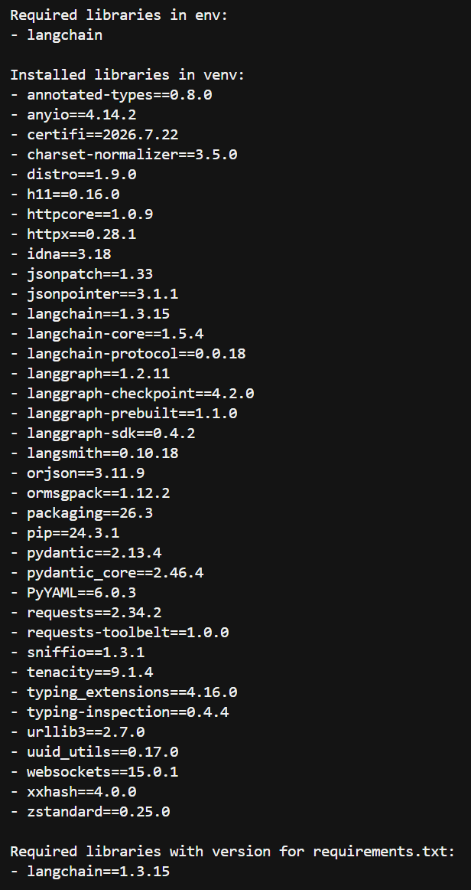

# Utils Shell Environment Setup

## Definition

This project provides a practical toolkit to standardize Python environment workflows across projects, with support for both `venv` and `conda`.

The objective is to make local onboarding and environment maintenance faster, more reliable, and easier to reuse on other repositories, enabling a quicker setup of a ready-to-use workspace with more attention on the core project.

## Project

The main goal is to reproduce a focused `pip freeze` output limited to libraries declared in `infra/requirements.txt`.

In a standard environment, `pip freeze` returns all installed packages, including transitive dependencies pulled indirectly by other libraries. This often produces noisy output when you only need versions for your direct project dependencies.

This project solves that by:
- detecting whether the runtime is `venv` or `conda`,
- collecting installed package names and versions from the active environment,
- filtering the result to keep only dependencies listed in `requirements.txt`.

The result is a cleaner dependency snapshot that is easier to review, share, and reuse: 



## Stack

- Python 3.11+
- Bash scripts (Git Bash compatible)
- `venv`
- `conda`
- `debugpy` (VS Code / Cursor debugger)

## Project Structure

```text
utils_shell_env_setup/
├── infra/
│   └── requirements.txt
├── script/
│   ├── install_requirements/
│   │   ├── installation_requirements_venv.sh
│   │   └── installation_requirements_conda.sh
│   ├── launch_program/
│   │   ├── launch_project_venv.sh
│   │   └── launch_project_conda.sh
│   ├── remove_env/
│   │   ├── remove_venv.sh
│   │   └── remove_conda.sh
│   └── utils/
│       └── conda_loader.sh
├── src/
│   ├── main.py
│   └── utils/
│       ├── env_detection.py
│       └── env_list_detection.py
└── .vscode/
    └── launch.json
```

## Installation

From the project root:

### venv

```shell
./script/install_requirements/installation_requirements_venv.sh
```

This script:
- checks Python availability and version,
- creates `venv`,
- activates the virtual environment,
- installs dependencies from `infra/requirements.txt`.

### conda

```shell
./script/install_requirements/installation_requirements_conda.sh
```

This script:
- checks Conda availability,
- creates a Conda environment named after the project directory,
- activates the Conda environment,
- installs dependencies from `infra/requirements.txt`.

## Quick Start

From the project root:

### Launch with venv

```shell
./script/launch_program/launch_project_venv.sh
```

### Launch with conda

```shell
./script/launch_program/launch_project_conda.sh
```

Both scripts run:

```shell
python src/main.py
```

## Manual Start

From the project root:

```shell
# Linux/macOS
source venv/bin/activate

# Windows Git Bash
source venv/Scripts/activate

python src/main.py
```

For Conda:

```shell
conda activate <your_env_name>
python src/main.py
```

## VS Code / Cursor Debug

The `.vscode/launch.json` file includes debug configurations:

- `Python: venv debug`
- `Python: conda debug`

## Remove Environment

From the project root:

### venv

```shell
./script/remove_env/remove_venv.sh
```

### conda

```shell
./script/remove_env/remove_conda.sh
```

## Notes

- `src/utils/env_detection.py` detects active environment signals and Python runtime context.
- `src/utils/env_list_detection.py` lists installed packages and maps required packages to pinned versions.
- The Conda package listing supports fallback via `conda-meta` when `conda` is not directly available in `PATH`.

## Contact Information

For inquiries or feedback, please contact me at [alexisegea@outlook.com](mailto:alexisegea@outlook.com).

## Copyright

© 2026 Alexis EGEA. All Rights Reserved.
